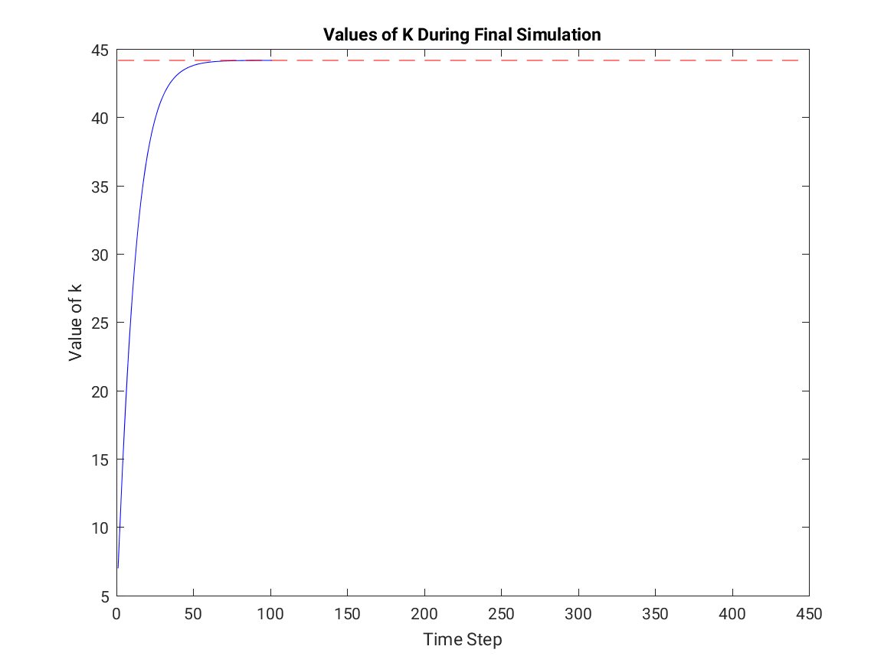

# Assignments 2-4
#### Zach Siegel

### Assignment 1

For this assignment, I made [an interactive Jupyter Notebook](https://mybinder.org/v2/gh/zsiegel92/mathcamp/master?filepath=assignments%2FMath%20Camp%20Assignment%20with%20Slider.ipynb) hosted on Binder.

### Assignment 2

* a)  
* b) `The three methods of maximizing profit found l = : 160, 159.9997, and 160.`
* c)  

```matlab
A=30;
K = 20;
ttheta = 1/3;
r=1;
w=10;

diff = @(l) w - (1-ttheta)*A*l.^(-ttheta)*K.^ttheta;
Pifun = @(l) A*K.^(ttheta)*l.^(1-ttheta) - r*K - w*l;

f = figure('visible','off');
plot(1:1000,Pifun(1:1000));
xlabel("l");
ylabel("\Pi (l)");
title("Profit vs Labor (all else fixed)")
saveas(f,'shared/Pi vs l','png');

plot(1:1000,diff(1:1000));
xlabel("l");
ylabel("w - (1-\theta)Al^{-\theta}K^{\theta}");
title("Difference (for FOC) vs Labor (all else fixed)")
saveas(f,'shared/Difference vs l','png');

lzero = fzero(diff,150,optimset('Display','off'));
lzero2 = fsolve(diff,150,optimset('Display','off'));
lzero3 = fminunc(@(l) -Pifun(l),150);
disp("The three methods of maximizing profit found l = : " + num2str(lzero) + ", " + num2str(lzero2) + ", and " + num2str(lzero3) + ".");

bestLabor = @(W) fzero(@(l) W - (1-ttheta)*A*l.^(-ttheta)*K.^ttheta,100,optimset('Display','off'));
bestProfit = @(W) Pifun(fzero(@(l) W - (1-ttheta)*A*l.^(-ttheta)*K.^ttheta,100,optimset('Display','off')));


plot(1:100,arrayfun(bestLabor,1:100));
xlabel("w");
ylabel("Optimal Labor");
title("Optimal Labor vs Wage")
saveas(f,'shared/Optimal Labor','png');

plot(1:100,arrayfun(bestProfit,1:100));
xlabel("w");
ylabel("Optimal Profit");
title("Profit at Optimal Labor vs Wage")
saveas(f,'shared/Optimal Profit','png');

```

### Assignment 3

* `Difference on interval [0,1000] is 0`
* 

```matlab
f = @(z) 3*z.^2 + 2*z;
F_analytic = @(z) z.^3 + z.^2;
% f = @(z) sin(z) + exp(-z^2);
% F = @(z) -cos(z) + (1/2)*sqrt(pi)*erf(z);

F_quadtx = @(z) quad(f,0,z);

disp("Difference on interval [0,1000] is " + num2str(F_analytic(1000) - F_quadtx(1000)));

n=10000;
interval = 0:pi/n:pi;

fig = figure('visible','off');
plot(interval,arrayfun(F_analytic,interval));
xlabel("x");
ylabel("\Integral_0^x f(z)dz");
title("Integral of f(x) = 3z^2 + 2z")
saveas(fig,'shared/Integral_fx','png');
```


### Assignment 4

* 
* 


```matlab
aalpha = 1/3;
bbeta = 0.96;
A = 1;
ddelta = 0.08;
T = 100;
k1_guess =100;
tolerance = 1e-10;
k = zeros(T+1,1);
g = @(k0,k1,k2) (A*k1^aalpha + (1-ddelta)*k1-k2) ...
    - bbeta*(A*k0^aalpha + (1-ddelta)*k0 - k1)...
    *(aalpha*A*k1^(aalpha-1) + (1-ddelta));
gss = @(kss) g(kss,kss,kss);
kss = fzero(gss,100,optimset('Display','off'));

kss_guesses = zeros(1000);
number_kss_guesses = 0;
k0=0.1*kss;
k(1) = k1_guess;
while abs(k(T+1) - kss) > tolerance && number_kss_guesses<1000
    f2 = @(k2) g(k0,k(1),k2);
    k(2) = fzero(f2,k(1),optimset('Display','off'));
    for i = 1:T-1
        f = @(k2)g(k(i),k(i+1),k2);
        k(i+2) = fzero(f,k(i+1),optimset('Display','off'));
    end
    if abs(k(T+1) - kss) > tolerance
        k(1) = k(1) -  0.5*(k(T+1) - kss); %UPDATE k1 GUESS
    end
    kss_guesses(number_kss_guesses+1) = k(T+1);
    number_kss_guesses = number_kss_guesses + 1;
    if rem(number_kss_guesses,10)==0
       disp(num2str(number_kss_guesses) + " simulations performed!");
    end
end
disp("Number of kss guesses is " + num2str(number_kss_guesses));
f = figure('visible','off');
plot(1:number_kss_guesses,kss_guesses(1:number_kss_guesses),'b',1:number_kss_guesses,kss*ones(number_kss_guesses,1),'r--');%,1:number_kss_guesses,repmat(kss,1),'r--'
xlabel("Simulation Number");
ylabel("Value of K_{T+1}");
title("Value of K_{T+1} During Iterations of Algorithm")
saveas(f,'shared/convergence_over_iterations','png');


plot(1:T+1,k,'b',1:number_kss_guesses,kss*ones(number_kss_guesses,1),'r--')
xlabel("Time Step");
ylabel("Value of k");
title("Values of K During Final Simulation")
saveas(f,'shared/time_series','png');
```
